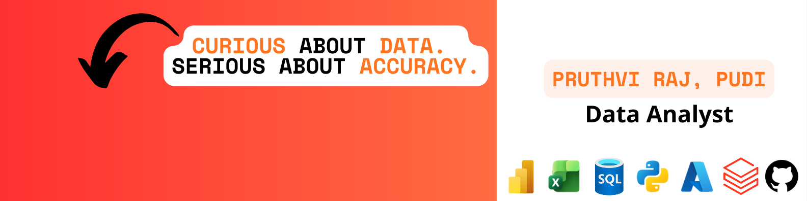

## 👨‍💻 About Me

Motivated and detail-oriented **Data Analyst** & an aspiring **Data Engineer** with 3.5 years of experience in risk operations, fraud investigations, ticket analysis, and quality auditing at **Amazon & Accenture**.

Recently completed my **Master’s in Data Science**, now building strong hands-on skills in:

- SQL (PostgreSQL, MySQL, SQL Server)  
- Python (pandas, numpy, matplotlib, scikit-learn) 
- Excel (Power Query, Power Pivot)
- Power BI & Tableau  
- Data modeling, ETL, dashboard design, automation
- Databricks

I love transforming raw data into dashboards, insights, and business recommendations.

Currently seeking **Data Analyst / Business Analyst / Product Analyst** roles.

## What I'm Working On  
- 📚 30 Days of SQL + HackerRank practice  
- 🏗 Building a SQL Data Warehouse (Bronze → Silver → Gold)  
- 📊 Creating Power BI dashboards (Sales, Finance, Healthcare)  
- 🤖 Exploring automation workflows with Python & Cloud  
 
## Skills & Tools 

### Languages & Databases  

  

### **Analytics & Visualization**

  
  
  

### **Tech Stack & Tools**

  
  
  
  

## GitHub Stats

  
  
  
  

  

## Let’s Connect

- 🌍 Based in **New Jersey, USA**  
- 📧 Email: **pruthvirajpudi@gmail.com**  
- 💼 LinkedIn: **linkedin.com/in/pruthvirajpudi**  
- 🌐 Portfolio: **datascienceportfol.io/pruthvirajpudi**
- If you're a recruiter, hiring manager, or fellow data practitioner — *I'd love to connect and collaborate!*

  
  
  

